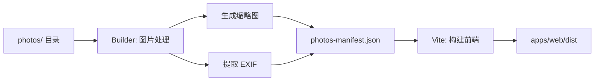

# AGENTS - Afilmory 静态站点版本

## 项目概述

Afilmory 是一个现代化的照片展示站点生成器，类似于 Hexo/Hugo，但专门为照片集设计。它将照片处理和前端构建整合为一个完整的静态站点生成流程。

## 核心理念

- **📸 照片优先**: 专注于照片展示的用户体验
- **⚡ 静态优先**: 无需数据库和后端服务器
- **🚀 易于部署**: 一键部署到 Vercel、Netlify 等平台
- **🎨 现代设计**: Glassmorphic 设计系统，流畅的交互体验

## 快速开始

### 开发命令

```bash
# 安装依赖
pnpm install

# 本地开发（不处理照片）
pnpm dev

# 构建完整静态站点（处理照片 + 构建前端）
pnpm build

# 只处理照片生成 manifest
pnpm build:manifest

# 只构建前端
pnpm build:web

# 预览构建结果
pnpm preview
```

### 构建流程详解

```bash
# 1. 将照片放入 photos/ 目录
mkdir photos
cp ~/Pictures/*.jpg photos/

# 2. 配置站点信息（可选）
cp config.example.json config.json
# 编辑 config.json

# 3. 构建静态站点
pnpm build

# 输出目录: apps/web/dist
```

### Manifest 构建选项

```bash
# 强制重新处理所有照片
pnpm build:manifest -- --force

# 只重新生成缩略图
pnpm build:manifest -- --force-thumbnails

# 只重新生成 manifest 文件
pnpm build:manifest -- --force-manifest
```

## 项目架构

### 目录结构

```
afilmory/
├── photos/                    # 📸 照片源文件目录
│   ├── 2024/
│   └── 2023/
├── apps/
│   └── web/                   # 🎨 前端 SPA 应用
│       ├── src/
│       ├── public/
│       └── dist/              # 构建产物
├── packages/
│   ├── builder/               # 🔨 照片处理工具
│   ├── webgl-viewer/          # 🖼️ WebGL 图片查看器
│   ├── data/                  # 📊 数据层
│   ├── ui/                    # 🎨 UI 组件
│   ├── hooks/                 # ⚓ React Hooks
│   └── utils/                 # 🔧 工具函数
├── scripts/
│   └── build-static.sh        # 构建脚本
├── config.json                # 站点配置
├── builder.config.static.ts   # 构建配置
└── vercel.json                # Vercel 部署配置
```

### 核心组件

#### 1. **照片处理工具** (`packages/builder`)

负责从存储源（本地文件系统或 S3）读取照片并进行处理：

- **格式转换**: HEIC → JPEG, TIFF → JPEG
- **缩略图生成**: 生成多种尺寸的缩略图
- **EXIF 提取**: 提取相机型号、拍摄参数、GPS 等信息
- **Live Photo 检测**: 识别 iPhone 动态照片
- **Blurhash 生成**: 生成模糊占位图
- **Manifest 生成**: 输出 `photos-manifest.json`

#### 2. **前端应用** (`apps/web`)

使用 Vite + React 19 构建的 SPA 应用：

- **技术栈**:
  - React 19 + TypeScript
  - Vite 7 构建工具
  - Tailwind CSS 4
  - Jotai 状态管理
  - TanStack Query 数据获取
  - React Router 7 路由
  - i18next 国际化

- **核心功能**:
  - 📷 Masonry 瀑布流布局
  - 🖼️ WebGL 高性能图片查看器
  - 🗺️ MapLibre 地图展示（GPS 信息）
  - 🎨 Glassmorphic 设计系统
  - 📱 PWA 支持
  - 🌐 多语言支持
  - 🔍 照片搜索和过滤

#### 3. **WebGL 查看器** (`packages/webgl-viewer`)

自定义 WebGL 组件，提供流畅的图片缩放和平移操作。

#### 4. **数据层** (`packages/data`)

- `PhotoLoader`: 照片数据加载单例
- 从 `photos-manifest.json` 读取照片元数据
- 支持分页、过滤、搜索

## 配置文件

### 站点配置 (`config.json`)

```json
{
  "name": "我的照片集",
  "title": "My Afilmory",
  "description": "记录生活中的美好瞬间",
  "url": "https://your-site.vercel.app",
  "accentColor": "#007bff",
  "author": {
    "name": "Your Name",
    "url": "https://your-website.com",
    "avatar": "https://your-avatar.jpg"
  },
  "social": {
    "github": "username",
    "twitter": "handle",
    "rss": true
  },
  "map": ["maplibre"],
  "mapStyle": "https://your-map-style.json",
  "mapProjection": "globe"
}
```

### 构建配置 (`builder.config.static.ts`)

```typescript
export default defineBuilderConfig(() => ({
  // 存储配置
  storage: {
    provider: 'local',      // 使用本地文件系统
    basePath: './photos',   // 照片源目录
    baseUrl: '/photos',     // 网站访问路径
  },

  // 处理选项
  system: {
    processing: {
      defaultConcurrency: 10,           // 并发数
      enableLivePhotoDetection: true,   // Live Photo
      digestSuffixLength: 0,
    },
    observability: {
      showProgress: true,
      showDetailedStats: true,
    },
  },
}))
```

### 使用 S3 存储

如果照片存储在 S3 上，修改 `storage` 配置：

```typescript
storage: {
  provider: 's3',
  bucket: 'my-bucket',
  region: 'us-east-1',
  endpoint: 'https://s3.amazonaws.com',
  accessKeyId: env.S3_ACCESS_KEY_ID,
  secretAccessKey: env.S3_SECRET_ACCESS_KEY,
  prefix: 'photos/',
  customDomain: 'https://cdn.example.com',
}
```

## 构建流程详解

### 完整构建 (`pnpm build`)

执行 `scripts/build-static.sh`:



1. **检查 photos 目录**: 确保有照片文件
2. **运行 Builder**: 处理照片并生成 manifest
   - 转换 HEIC/TIFF 格式
   - 生成多尺寸缩略图
   - 提取 EXIF 信息
   - 生成 Blurhash
   - 输出 `apps/web/src/data/photos-manifest.json`
3. **构建前端**: Vite 打包 React 应用
   - 代码分割和优化
   - 生成 PWA manifest
   - 生成 OG 图片
   - 生成 sitemap.xml
   - 输出到 `apps/web/dist`

### 增量构建

Builder 会智能检测变更：

- **新增照片**: 只处理新文件
- **修改照片**: 重新处理修改的文件
- **删除照片**: 从 manifest 中移除

使用文件 hash 和修改时间来判断变更。

## 部署

### Vercel

```bash
# 方式 1: CLI 部署
vercel --prod

# 方式 2: Git 自动部署
git push origin main
```

`vercel.json` 已配置：

```json
{
  "buildCommand": "sh scripts/build-static.sh",
  "outputDirectory": "apps/web/dist"
}
```

### 其他平台

| 平台 | Build Command | Output Directory |
|------|--------------|-----------------|
| Netlify | `sh scripts/build-static.sh` | `apps/web/dist` |
| Cloudflare Pages | `sh scripts/build-static.sh` | `apps/web/dist` |
| GitHub Pages | `sh scripts/build-static.sh` | `apps/web/dist` |

## 性能优化

### 图片加载策略

- **缩略图优先**: 瀑布流使用小尺寸缩略图
- **懒加载**: 使用 Intersection Observer
- **渐进式加载**: Blurhash → 缩略图 → 原图
- **WebP 格式**: 自动生成 WebP 缩略图

### 代码分割

- 按路由分割
- 重依赖单独打包 (heic-to, maplibre-gl)
- Tree-shaking 移除未使用代码

### 缓存策略

```
/assets/*    - Cache-Control: immutable, max-age=31536000
/photos/*    - Cache-Control: immutable, max-age=31536000
/index.html  - Cache-Control: no-cache
```

## 国际化

支持多语言，配置在 `locales/` 目录：

- `en/`: English
- `zh-CN/`: 简体中文
- `ja/`: 日本語

添加新语言：

1. 在 `locales/` 创建语言目录
2. 复制 `common.json` 并翻译
3. 更新 `apps/web/src/i18n.ts`

## 常见问题

### 1. 构建很慢

- **原因**: 照片数量多，首次构建需要处理所有照片
- **解决**:
  - 调整 `defaultConcurrency` 参数
  - 后续构建是增量的，只处理变更
  - 考虑使用 CI/CD 缓存

### 2. 图片不显示

- **检查**: `apps/web/dist/photos/` 是否有文件
- **检查**: `photos-manifest.json` 是否生成
- **检查**: 浏览器控制台是否有 404 错误

### 3. EXIF 信息缺失

- **原因**: 照片可能被编辑软件移除了 EXIF
- **解决**: 使用原始照片文件

### 4. Vercel 构建超时

- **原因**: 免费版构建时间限制 45 分钟
- **解决**: 本地构建后使用 `vercel --prebuilt` 部署

## 代码质量

```bash
# 类型检查
pnpm --filter web type-check

# 代码检查和自动修复
pnpm lint

# 代码格式化
pnpm format
```

## 更多信息

- [部署指南](./DEPLOY_STATIC.md)
- [完整 README](./README.md)
- [GitHub Issues](https://github.com/Afilmory/Afilmory/issues)
