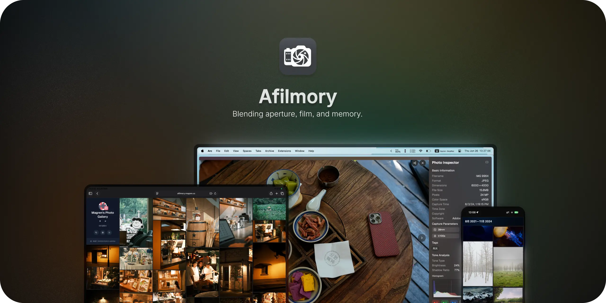

# Afilmory Vercel

[English](./README.md) | 简体中文

<p align="center">
  
</p>

<p align="center">
  <strong>S3 优先、支持零凭据本地模式并面向 Vercel 静态部署的照片画廊</strong>
</p>

<p align="center">
  <a href="#-快速开始">快速开始</a> •
  <a href="#-特性">特性</a> •
  <a href="#-部署">部署</a> •
  <a href="#-在线演示">在线演示</a>
</p>

<p align="center">
  <a href="https://vercel.com/new/clone?repository-url=https%3A%2F%2Fgithub.com%2Fvsxd%2Fafilmory-vercel&env=S3_BUCKET_NAME%2CS3_ACCESS_KEY_ID%2CS3_SECRET_ACCESS_KEY%2CS3_REGION%2CS3_ENDPOINT&envDescription=%E5%A1%AB%E5%86%99%E5%AD%98%E5%82%A8%E6%A1%B6%E5%92%8C%E8%AF%BB%E5%8F%96%E5%87%AD%E6%8D%AE%EF%BC%9B%E6%8C%89%E5%AD%98%E5%82%A8%E6%9C%8D%E5%8A%A1%E8%B0%83%E6%95%B4%E9%A2%84%E5%A1%AB%E7%9A%84%E5%8C%BA%E5%9F%9F%E5%92%8C%E7%AB%AF%E7%82%B9%E3%80%82&envLink=https%3A%2F%2Fgithub.com%2Fvsxd%2Fafilmory-vercel%2Fblob%2Fmain%2FREADME.zh-CN.md%23s3-%E7%85%A7%E7%89%87%E6%BA%90%E9%85%8D%E7%BD%AE&project-name=my-afilmory&repository-name=my-afilmory&envDefaults=%7B%22S3_REGION%22%3A%22us-east-1%22%2C%22S3_ENDPOINT%22%3A%22https%3A%2F%2Fs3.us-east-1.amazonaws.com%22%7D">
    
  </a>
</p>

---

## 📖 关于本项目

本项目基于 [Afilmory](https://github.com/Afilmory/afilmory) 修改，聚焦静态站点部署。原图既可来自 S3 兼容对象存储（部署默认值），也可来自本地目录，以便完成零凭据、自包含构建。构建过程生成静态 Web 应用、缩略图、RSS、sitemap、Open Graph 图片和 JSON 照片 manifest。

### 与上游项目的区别

- ✅ **S3 优先的静态部署** - 默认使用 S3 兼容存储，同时提供显式的本地文件系统模式。
- ✅ **面向 Vercel 的构建** - `vercel.json` 运行 `scripts/build-static.sh`，输出目录为 `apps/web/dist`。
- ✅ **Manifest 驱动运行时** - 浏览器读取构建生成的 JSON 数据，不需要数据库或后端服务。
- ✅ **可选远程元数据缓存** - `REPO_URL` 和 `REPO_TOKEN` 可在 CI 构建之间复用 manifest 与缩略图。
- ✅ **一键部署** - Vercel Deploy 按钮已配置必需的 S3 环境变量。

### 致谢

感谢 [Innei](https://innei.in) 和 Afilmory 团队创建了这个优秀的照片集生成器项目。

> 💡 如果你需要完整的上游功能和最新上游更新，请使用[原版 Afilmory](https://github.com/Afilmory/afilmory)。

---

## 🌟 特性

### 核心功能

- 🖼️ **高性能 WebGL 渲染器** - React 19 WebGL 查看器，支持流畅缩放、平移、分块加载和错误回调。
- 📱 **响应式瀑布流布局** - 自研纯计算虚拟瀑布流，整数像素几何，滚动时不做 DOM 测量。
- 🎨 **现代 UI 设计** - 使用 Tailwind CSS 4、Radix UI 和 Motion 构建毛玻璃风格界面。
- ⚡ **增量构建** - 未变化照片会复用已有 manifest 数据、缩略图、EXIF 和影调分析。
- 🌐 **国际化** - 语言资源来自 `locales/app/*.json`。
- 🔗 **可抓取的照片页** - 构建时生成首页 Open Graph 图片、每张照片独立的 canonical/OG/JSON-LD HTML shell、`feed.xml` 和 `sitemap.xml`。

### 图片处理

- 🔄 **HEIC/HEIF/HIF 支持** - Apple 格式会在处理阶段转换。
- 📷 **TIFF/TIF、WebP、BMP、PNG、JPG/JPEG 支持** - 支持扩展名定义在 `packages/builder/src/constants/index.ts`。
- 🖼️ **生成缩略图** - 缩略图写入 `apps/web/public/thumbnails` 并进入静态产物。
- 📊 **EXIF 展示** - Builder 使用 `exiftool-vendored` 提取元数据，前端查看器可展示。
- 🌈 **ThumbHash 占位图** - manifest 中的 `thumbHash` 用于渐进式加载占位。
- 📱 **Live Photo 和 Motion Photo 支持** - 独立视频文件和嵌入式 Motion Photo 元数据都会记录为视频来源。
- ☀️ **HDR 元数据支持** - 可检测 Ultra HDR gain map 元数据。

### 存储与运行时

- ☁️ **S3 兼容照片源** - 支持 AWS S3、MinIO、阿里云 OSS、腾讯云 COS 等 S3 兼容服务。
- 💻 **本地文件系统照片源** - 设置 `PHOTO_STORAGE_PROVIDER=local` 即可在没有对象存储凭据时构建。
- 🌍 **CDN 友好 URL** - 可通过 `S3_CUSTOM_DOMAIN` 生成公开照片 URL。
- 📦 **按 provider 生成静态产物** - S3 原图保留在对象存储中；本地模式会把原图复制到静态产物的配置路径。
- 🚀 **渐进式静态运行时** - 生产构建输出轻量、内容寻址的 `gallery-index`，并按稳定 ID 哈希拆分照片详情和地图数据；路由只通过 `window.__AFILMORY__.manifest` 补齐所需数据。

---

## 🖥️ 截图

<p align="center">
  
</p>

<p align="center">
  
</p>

---

## 🎯 在线演示

- [Official Demo](https://afilmory.innei.in) - Afilmory 官方演示
- [Xudong's Lens](https://lens.misfork.com)
- [Gallery by mxte](https://gallery.mxte.cc)
- [Photography by pseudoyu](https://photography.pseudoyu.com)
- [Afilmory by magren](https://afilmory.magren.cc)

---

## 🚀 快速开始

先安装 Node.js `^20.19.0 || >=22.12.0` 和 pnpm 10.19.0，再运行以下命令，无需凭据或个人照片即可体验完整界面：

```bash
git clone https://github.com/vsxd/afilmory-vercel.git
cd afilmory-vercel
pnpm install --frozen-lockfile
pnpm dev:demo
```

该命令在 `http://127.0.0.1:1924` 提供仓库内置的合成相册，不读取 `.env`、S3 凭据或你的 generated manifest。

交互地图使用 MapLibre GL 6，需要浏览器支持 WebGL2。不可用时仍可浏览照片，位置面板显示坐标，完整地图显示不可用状态；照片查看器也支持普通图片降级显示。

### 一键部署到 Vercel

准备至少包含一张照片的存储桶，以及具有列出和读取权限的密钥对。按钮只要求五项存储设置：桶名、密钥对、区域和端点。区域和端点已预填 AWS S3 `us-east-1` 的值，使用其他存储服务时按实际配置修改。

[](https://vercel.com/new/clone?repository-url=https%3A%2F%2Fgithub.com%2Fvsxd%2Fafilmory-vercel&env=S3_BUCKET_NAME%2CS3_ACCESS_KEY_ID%2CS3_SECRET_ACCESS_KEY%2CS3_REGION%2CS3_ENDPOINT&envDescription=%E5%A1%AB%E5%86%99%E5%AD%98%E5%82%A8%E6%A1%B6%E5%92%8C%E8%AF%BB%E5%8F%96%E5%87%AD%E6%8D%AE%EF%BC%9B%E6%8C%89%E5%AD%98%E5%82%A8%E6%9C%8D%E5%8A%A1%E8%B0%83%E6%95%B4%E9%A2%84%E5%A1%AB%E7%9A%84%E5%8C%BA%E5%9F%9F%E5%92%8C%E7%AB%AF%E7%82%B9%E3%80%82&envLink=https%3A%2F%2Fgithub.com%2Fvsxd%2Fafilmory-vercel%2Fblob%2Fmain%2FREADME.zh-CN.md%23s3-%E7%85%A7%E7%89%87%E6%BA%90%E9%85%8D%E7%BD%AE&project-name=my-afilmory&repository-name=my-afilmory&envDefaults=%7B%22S3_REGION%22%3A%22us-east-1%22%2C%22S3_ENDPOINT%22%3A%22https%3A%2F%2Fs3.us-east-1.amazonaws.com%22%7D)

原图使用独立 CDN 或公开域名时，请选择[配置公开原图域名并部署](https://vercel.com/new/clone?repository-url=https%3A%2F%2Fgithub.com%2Fvsxd%2Fafilmory-vercel&env=S3_BUCKET_NAME%2CS3_ACCESS_KEY_ID%2CS3_SECRET_ACCESS_KEY%2CS3_REGION%2CS3_ENDPOINT%2CS3_CUSTOM_DOMAIN&envDescription=%E5%A1%AB%E5%86%99%E5%AD%98%E5%82%A8%E6%A1%B6%E5%92%8C%E8%AF%BB%E5%8F%96%E5%87%AD%E6%8D%AE%EF%BC%9B%E6%8C%89%E5%AD%98%E5%82%A8%E6%9C%8D%E5%8A%A1%E8%B0%83%E6%95%B4%E9%A2%84%E5%A1%AB%E7%9A%84%E5%8C%BA%E5%9F%9F%E5%92%8C%E7%AB%AF%E7%82%B9%E3%80%82&envLink=https%3A%2F%2Fgithub.com%2Fvsxd%2Fafilmory-vercel%2Fblob%2Fmain%2FREADME.zh-CN.md%23s3-%E7%85%A7%E7%89%87%E6%BA%90%E9%85%8D%E7%BD%AE&project-name=my-afilmory&repository-name=my-afilmory&envDefaults=%7B%22S3_REGION%22%3A%22us-east-1%22%2C%22S3_ENDPOINT%22%3A%22https%3A%2F%2Fs3.us-east-1.amazonaws.com%22%7D)，额外填写 `S3_CUSTOM_DOMAIN`。存储桶端点本身可公开读取原图时，使用上方主按钮即可。

**部署步骤：**

1. 点击上方部署按钮。
2. 登录 Vercel，并 fork/import 仓库。
3. 填写存储设置。原图必须能从存储桶或 CDN 公开读取，并配置允许图库来源的 CORS。
4. 点击 **Deploy**。
5. Vercel 构建会运行 `scripts/build-static.sh`，其内部执行 `pnpm build`；bucket 与凭据来源有效时由 precheck 刷新 manifest。

Vercel 构建会自动使用项目的生产域名生成站点链接，预览部署也保持该域名。只有需要指定其他 canonical 域名时才填写 `SITE_URL`。站点名称、作者、社交链接、地图偏好等可选设置可在部署后通过 **Project Settings → Environment Variables** 添加，再重新部署。已经配置其他 AWS 凭据来源、不需要密钥对表单时，可直接导入仓库。

S3 刷新成功后，Vercel 部署和 fresh build 会匿名抽查一张原图的公开地址：只请求开头的一段字节，读取第一个响应块后停止，最长五秒。构建日志会提示权限不足、对象不存在、返回错误页或 CORS 响应不匹配等问题，不打印照片 URL。这些检查只产生警告，无法覆盖所有照片、CDN 跳转和预览域名；部署后请打开一张照片验证实际访问。原图加载失败时，查看器会显示具体提示，并提供“重试”操作。

---

## ⚙️ 环境变量配置

构建时，`site.config.build.ts` 会把环境变量覆盖合并到 `site.config.ts` 默认值中。浏览器端通过 `window.__AFILMORY__.config` 获取最终配置，不在运行时读取 `process.env`。

### 选择照片源

| 环境变量                 | 说明                           | 默认值       |
| ------------------------ | ------------------------------ | ------------ |
| `PHOTO_STORAGE_PROVIDER` | 照片源适配器：`s3` 或 `local`  | `s3`         |
| `LOCAL_PHOTOS_PATH`      | 本地照片目录（相对仓库根目录） | `photos`     |
| `LOCAL_PHOTOS_BASE_URL`  | 本地原图使用的公开 URL 前缀    | `/originals` |

本地模式不需要任何 S3 凭据：

```bash
PHOTO_STORAGE_PROVIDER=local
LOCAL_PHOTOS_PATH=photos
LOCAL_PHOTOS_BASE_URL=/originals
```

把原图放入 `LOCAL_PHOTOS_PATH`。开发服务器会通过
`LOCAL_PHOTOS_BASE_URL` 提供这些文件；生产构建会把它们复制到
`apps/web/dist` 对应路径。建议保留不会与应用路由冲突的 `/originals` 默认值；
自定义前缀只能使用可移植的 ASCII 路径段；`/photos`、`/assets`、
`/thumbnails` 和 `/vendor` 是应用保留命名空间。

Git 默认忽略仓库根目录的 `photos/` 和本地 `.env` 变体。若在仓库内改用其他照片目录，请先将它加入 `.gitignore`，再复制个人照片。

### S3 照片源配置

当 `PHOTO_STORAGE_PROVIDER=s3` 时，只有 bucket 名称始终必填：

| 环境变量         | 说明          | 示例        |
| ---------------- | ------------- | ----------- |
| `S3_BUCKET_NAME` | S3 存储桶名称 | `my-photos` |

`S3_ACCESS_KEY_ID` 与 `S3_SECRET_ACCESS_KEY` 是可选的一对：显式配置时必须同时提供，只设置其中一个会被视为配置错误。两者都省略时使用 AWS SDK 默认凭据链（shared config/SSO、Web Identity、ECS/EC2 role 等）。大多数非 AWS 的 S3 兼容服务仍需要显式密钥对。

### S3 可选项

| 环境变量           | 说明                 | 默认值                               | 示例                                   |
| ------------------ | -------------------- | ------------------------------------ | -------------------------------------- |
| `S3_REGION`        | S3 区域              | `us-east-1`                          | `us-west-2`                            |
| `S3_ENDPOINT`      | S3 服务端点          | `https://s3.us-east-1.amazonaws.com` | `https://oss-cn-hangzhou.aliyuncs.com` |
| `S3_PREFIX`        | 照片路径前缀         | 空                                   | `photos/`                              |
| `S3_CUSTOM_DOMAIN` | 自定义 CDN 域名      | 空                                   | `https://cdn.example.com`              |
| `S3_EXCLUDE_REGEX` | 排除文件的正则表达式 | 空                                   | `.*\.txt$`                             |

> ⚠️ **全分辨率查看器的 CORS（跨域）要求。** WebGL 查看器通过 `fetch`/XHR 获取
> 原图字节，因此当两者不同源时（例如 `cdn.example.com` 与
> `gallery.example.com`），提供原图的域名（`S3_CUSTOM_DOMAIN` 或 S3 端点）
> **必须返回允许站点来源（`SITE_URL`）的 `Access-Control-Allow-Origin`
> 响应头**。缩略图是同源资源（`/thumbnails`），不需要 CORS，因此缺少 CORS
> 响应头的典型症状是：缩略图加载正常，但打开照片时卡在 "Failed to load
> image"。本地对只允许生产域名的 CDN 运行 `vite preview` 时同样会遇到此问题。

### 可选 CI 元数据缓存

| 环境变量           | 说明                                                          |
| ------------------ | ------------------------------------------------------------- |
| `REPO_URL`         | 用于缓存生成的 `photos-manifest.json` 和缩略图的 Git 仓库地址 |
| `REPO_TOKEN`       | artifact cache 脚本推送缓存更新时使用的 token                 |
| `BUILDER_REPO_URL` | `REPO_URL` 的兼容别名                                         |
| `GIT_TOKEN`        | `REPO_TOKEN` 的兼容别名                                       |

这个缓存不是照片存储后端，原始照片仍来自所配置的 S3 或本地 provider。

### 站点配置

| 环境变量            | 说明                           | 示例                                  |
| ------------------- | ------------------------------ | ------------------------------------- |
| `SITE_NAME`         | 站点名称                       | `My Photo Gallery`                    |
| `SITE_TITLE`        | 站点标题                       | `My Photo Gallery`                    |
| `SITE_DESCRIPTION`  | 站点描述                       | `Capturing beautiful moments in life` |
| `SITE_URL`          | 可选的 canonical 站点 URL 覆盖 | `https://your-site.vercel.app`        |
| `SITE_ACCENT_COLOR` | 主题色                         | `#007bff`                             |

站点 URL 的优先级为：显式 `SITE_URL` → Vercel 的 `VERCEL_PROJECT_PRODUCTION_URL`（补上 `https://`）→ `site.config.ts`。只有 `VERCEL=1` 时才使用 Vercel 的生产域名，本地和其他静态构建保留原有默认值；临时预览地址不会成为 canonical URL。请保留 Vercel 自动暴露系统环境变量的设置，或显式填写 `SITE_URL`。

| 环境变量        | 说明         | 示例                        |
| --------------- | ------------ | --------------------------- |
| `AUTHOR_NAME`   | 作者名称     | `Your Name`                 |
| `AUTHOR_URL`    | 作者网站     | `https://your-website.com`  |
| `AUTHOR_AVATAR` | 作者头像 URL | `https://example.com/a.png` |

| 环境变量         | 说明           | 示例                    |
| ---------------- | -------------- | ----------------------- |
| `SOCIAL_GITHUB`  | GitHub 用户名  | `your-github-username`  |
| `SOCIAL_TWITTER` | Twitter/X 用户 | `your-twitter-username` |
| `SOCIAL_RSS`     | 是否显示 RSS   | `true` 或 `false`       |

| 环境变量            | 说明         | 示例           |
| ------------------- | ------------ | -------------- |
| `FEED_FOLO_FEED_ID` | Folo Feed ID | `your-feed-id` |
| `FEED_FOLO_USER_ID` | Folo User ID | `your-user-id` |

| 环境变量         | 说明     | 默认值     | 可选值                 |
| ---------------- | -------- | ---------- | ---------------------- |
| `MAP_STYLE`      | 地图样式 | `builtin`  | `builtin` 或自定义 URL |
| `MAP_PROJECTION` | 地图投影 | `mercator` | `globe` 或 `mercator`  |

### 位置隐私与可选反向地理编码

`PHOTO_LOCATION_MODE=coarse` 是保护隐私的默认值：坐标在写入 manifest 或离开 Builder 前会保留两位小数（公里级）。`strip` 完全不发布坐标和地名；`exact` 会原样发布相机 GPS，只应在被摄人物及地点所有者知情同意时使用。

上述设置仅影响生成的 manifest 和地理编码请求，不会删除原图内的元数据：S3 原图仍由远端提供，本地原图会原样复制。能下载原图的访客仍可能读取其中的 EXIF/GPS。需要保密时，请在发布前清除源照片中的敏感元数据。

反向地理编码**默认关闭**，因为它会把上述位置发送给外部服务。设置 `GEOCODING_ENABLED=true` 才会启用；启用 Nominatim 时，请按其[使用政策](https://operations.osmfoundation.org/policies/nominatim/)提供真实的 `GEOCODING_USER_AGENT`（不超过 1 request/second）。也可以使用 `GEOCODING_PROVIDER=mapbox` 和 `MAPBOX_TOKEN`。`strip` 始终禁止 geocoding，`coarse` 不会发送相机原始精确坐标。完整配置见 `.env.template`。

### 本地 `.env`

```bash
cp .env.template .env
```

示例：

```bash
PHOTO_STORAGE_PROVIDER=s3
S3_BUCKET_NAME=my-photos
S3_REGION=us-east-1
S3_ACCESS_KEY_ID=your-access-key-id
S3_SECRET_ACCESS_KEY=your-secret-access-key

SITE_NAME=My Photo Gallery
SITE_TITLE=My Photo Gallery
SITE_DESCRIPTION=Capturing beautiful moments in life
SITE_URL=https://your-site.vercel.app

AUTHOR_NAME=Your Name
AUTHOR_URL=https://your-website.com
AUTHOR_AVATAR=https://example.com/avatar.png

SOCIAL_GITHUB=your-github-username
SOCIAL_RSS=true
```

如需零凭据本地配置，请用[选择照片源](#选择照片源)中的三个本地变量替换 S3 配置块。

---

## 💻 本地开发

### 前置要求

- Node.js `^20.19.0 || >=22.12.0`（以 `package.json` 为准）
- pnpm 10.19.0
- S3 兼容对象存储或一个本地照片目录

### 安装依赖

```bash
git clone https://github.com/vsxd/afilmory-vercel.git
cd afilmory-vercel
pnpm install
```

### 准备照片源

可以把照片上传到 S3 兼容对象存储，也可以设置 `PHOTO_STORAGE_PROVIDER=local` 并把照片放入 `LOCAL_PHOTOS_PATH`。支持的图片扩展名包括 `.jpg`、`.jpeg`、`.png`、`.webp`、`.bmp`、`.tiff`、`.tif`、`.heic`、`.heif` 和 `.hif`。

S3 模式下 manifest 指向 S3/CDN URL，原图不会打包；本地模式会把原图复制到 `apps/web/dist` 的 `LOCAL_PHOTOS_BASE_URL` 对应路径，产物可以自包含运行。

### 构建和预览

```bash
# 开发服务器。会先运行 precheck。
pnpm dev

# 完整静态构建：precheck，然后 Vite Web 构建。workspace 包直接从
# TypeScript 源码消费，部署构建不需要预先构建包的 dist/。
pnpm build

# 只刷新 manifest 和缩略图。
pnpm build:manifest

# 使用已有 manifest 只构建前端。
pnpm build:web

# 本地预览 apps/web/dist。
pnpm preview

# 重新生成 favicon 资源到 apps/web/public。
pnpm generate:favicon
```

所有 `@afilmory/*` 包均为 workspace 内部包——直接从 TypeScript 源码消费，不发布到 npm。

运行 `pnpm preview` 后打开 http://localhost:4173。

### Manifest 构建行为

- `pnpm dev` 和 `pnpm build` 会先运行 `apps/web/scripts/precheck.ts`。
- 本地模式会直接运行 builder，不需要 S3 凭据。
- S3 bucket 和有效凭据来源可用时，precheck 会通过 builder 刷新 manifest。
- 缺少必需的 S3 配置但存在 `generated/photos-manifest.json` 时，precheck 会复用已有 manifest。
- builder 失败时，Preview 仅在当前磁盘 manifest 仍通过严格校验时继续并输出警告。precheck 不会单独回滚 JSON，因为晚期失败可能发生在新 manifest 已原子提交、旧内容寻址缩略图已清理之后。
- `SKIP_MANIFEST_BUILD=true pnpm build` 会显式跳过 builder 刷新。
- 生产 Web 构建会把 Builder manifest v2 转成 Web Delivery Manifest v3：带 hash 的 gallery index、稳定 ID 详情分片和地图分片。可用 `AFILMORY_EMBED_MANIFEST=true` 为受限部署强制内联 v2，或用 `false` 强制渐进式外置加载。

### Manifest CLI 选项

```bash
pnpm build:manifest -- --force
pnpm build:manifest -- --force-thumbnails
pnpm build:manifest -- --force-manifest
```

---

## 📦 部署

### 部署到 Vercel

Vercel 使用：

- **构建命令：** `sh scripts/build-static.sh`
- **输出目录：** `apps/web/dist`

配置了 `REPO_URL` 和 `REPO_TOKEN` 时，`scripts/build-static.sh` 会先恢复 manifest 和缩略图，再执行构建并同步新产物。缓存仓库必须独立且私有：`exact` 模式可能缓存精确坐标；`coarse` 和 `strip` 不会传输 `geocoding-cache.json`，并会在恢复/保存边界删除旧的精确缓存。缓存默认使用专用 `afilmory-cache` 分支和最小权限 token，并拒绝源码仓库及受保护分支。详见[缓存安全指南](docs/cache-security.md)。

`scripts/build-static.sh` 始终运行 `pnpm build`；所有新鲜度与降级决策统一由 `apps/web/scripts/precheck.ts` 负责。缺少必需的 S3 配置但存在可复用 `generated/photos-manifest.json` 时，precheck 会复用它，让 Preview 部署仍可成功。生产部署（`VERCEL_ENV=production`，其他平台可用 `REQUIRE_FRESH_BUILD=true`）则会失败，拒绝发布陈旧 manifest。

CI/Vercel 构建还会校验发布代码是否能由页脚声明的 Git revision 精确复现。应先提交部署源码；如必须发布脏树产物，需设置 `AFILMORY_CORRESPONDING_SOURCE_URL`，指向公开且包含本次精确源码的 archive/tree。本地脏树仍可预览，页脚会明确标为非精确源码。

部署本地 provider 时，构建工作区必须能访问 `LOCAL_PHOTOS_PATH`。构建会把这些原图复制进静态产物；请勿误把私密照片提交到公开仓库。

### 其他静态托管平台

可以把 `apps/web/dist` 部署到任何静态托管平台：

- Cloudflare Pages
- Netlify
- GitHub Pages
- 任意支持 SPA fallback 到 `index.html` 的静态托管服务

构建命令使用 `pnpm build`。

当前应用的资源与路由使用根相对 URL，应部署在域名根路径，而非 `/afilmory-vercel/` 等仓库子路径。请为 `/explore` 等应用路由配置 SPA `index.html` 回退，同时保留生成的照片页面和静态资源。`vercel.json` 中的重写与安全响应头只适用于 Vercel，其他平台需配置对应规则。GitHub Pages 需要自行处理 SPA 回退，并使用域名根路径部署，不能直接沿用默认的项目子路径 URL。

---

## 🔄 更新照片

1. 将新增或修改后的照片上传到 S3 bucket；本地模式则更新 `LOCAL_PHOTOS_PATH`。
2. 触发一次新部署，或运行 `pnpm build:manifest`。
3. Builder 会对比源对象元数据和已有 manifest，尽量只处理变化部分。

---

## 🏗️ 技术栈

### 前端

- React 19 与 React Compiler
- TypeScript 5.9
- Vite 8
- Tailwind CSS 4
- Radix UI
- Motion
- Jotai
- React Router 8
- i18next 与 react-i18next
- MapLibre GL 与 react-map-gl

### 构建系统

- Node.js
- pnpm workspace
- Sharp：图片处理和 Open Graph 图片生成
- exiftool-vendored：EXIF 提取
- AWS SDK v3：S3 访问
- node:cluster 多进程或单进程并发池：并发处理
- thumbhash：紧凑图片占位符

---

## 📁 项目结构

```text
afilmory/
├── apps/
│   └── web/                   # 前端 SPA 应用
├── packages/
│   ├── build-assets/          # 构建期 OG 图片、feed.xml 和 sitemap.xml 生成
│   ├── builder/               # 照片处理与 manifest builder
│   ├── media/                 # 零依赖 thumbhash 字节/hex 编解码叶子包
│   ├── schema/                # manifest 契约：类型与 strict/lenient 解析器
│   ├── ui/                    # 共享 UI 基元与 hooks
│   └── webgl-viewer/          # WebGL 图片查看器包
├── docs/
│   ├── assets/                # README 图片
│   ├── CONTRIBUTING.md        # 贡献者环境与流程
│   ├── rss-exif-extension.md  # RSS EXIF 扩展说明
│   ├── security-notes.md      # 安全相关配置说明
│   └── testing.md             # Vitest 与 Playwright 测试/CI 指南
├── generated/                 # 生成的 photos-manifest.json
├── locales/app/               # i18n JSON 资源
├── scripts/                   # 构建期辅助脚本
├── site.config.ts             # 浏览器安全的站点默认值
├── site.config.build.ts       # 构建期环境变量合并
├── builder.config.ts          # S3/本地照片处理配置
└── vercel.json                # 静态部署配置
```

---

## 🎨 自定义

### 修改主题色

使用 `SITE_ACCENT_COLOR`，或编辑 `site.config.ts`：

```typescript
export const siteConfig: SiteConfig = {
  // ...
  accentColor: "#ff6b6b",
};
```

### 添加地图样式

使用 `MAP_STYLE` 和 `MAP_PROJECTION`，或编辑 `site.config.ts`：

```typescript
export const siteConfig: SiteConfig = {
  // ...
  map: ["maplibre"],
  mapStyle: "https://your-map-style.json",
  mapProjection: "globe",
};
```

### 国际化

语言文件位于 `locales/app/*.json`。添加新语言：

1. 在 `locales/app` 下添加新的 JSON 文件。
2. 在 `apps/web/src/@types/resources.ts` 导入并注册资源。
3. 在 `apps/web/src/@types/constants.ts` 添加语言代码。

---

## 🤝 贡献

欢迎贡献代码、报告问题或提出建议。

请查看[贡献指南](docs/CONTRIBUTING.md)了解环境准备与验证要求，查看[安全策略](SECURITY.md)了解私密漏洞报告流程，并遵守[行为准则](CODE_OF_CONDUCT.md)。

---

## 📄 许可证

本项目基于 [Afilmory](https://github.com/Afilmory/Afilmory) 修改，遵循原项目的许可证：

**Attribution Network License (ANL) v1.0**

- **Library code**: MIT
- **Project code**: AGPL-3.0-or-later with UI attribution requirement

详见 [LICENSE](LICENSE)、机器可读的 [ANL-MANIFEST](ANL-MANIFEST) 和[许可证映射说明](docs/licensing.md)。

---

## 🔗 相关链接

- **原版 Afilmory**: [github.com/Afilmory/Afilmory](https://github.com/Afilmory/Afilmory)
- **在线演示**: [afilmory.innei.in](https://afilmory.innei.in)
- **问题反馈**: [GitHub Issues](https://github.com/vsxd/afilmory-vercel/issues)
- **原项目作者博客**: [innei.in](https://innei.in)

---

## 💝 致谢

- 感谢 [Innei](https://innei.in) 和 Afilmory 团队创建原项目。
- 感谢所有使用本项目的摄影爱好者。
- 感谢所有开源贡献者。

<p align="center">
  <sub>如果这个项目对你有帮助，欢迎给个 Star 支持。</sub>
</p>
