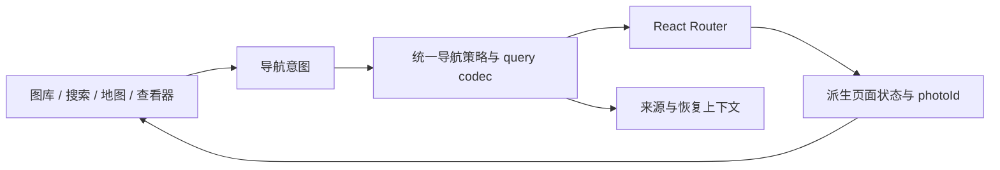

# 架构审计与导航重构建议

审计基线：`ce419def`，2026-09-07。范围涵盖 Web 导航、页面状态、媒体加载与转换、运行时缓存、manifest 发布及生产验证链路。本轮只做诊断，没有修改业务代码或部署。以下区分已复现缺陷、由调用链确认的设计风险，以及需要产品决策的取舍；不是所有模块的穷尽审计。

后续实施：本文保留重构前的审计基线。导航整改及验收约定见 [导航重构方案](./navigation-refactor.md)，下文涉及的旧文件和缺陷描述不代表整改后的状态。

## 结论

优先重构导航与页面状态。当前项目已经具备合理的静态站点基础：Builder workflow 分层、共享 manifest schema、PhotoRepository 分片加载、WebGL engine/service 拆分都值得保留。主要问题发生在这些模块之间，尤其是“谁拥有页面状态、何时可以写 URL、任务何时结束”的契约。

导航层并行维护 React Router location、routeAtom 镜像、查看器 openAtom/currentIndexAtom、viewerSourceModeAtom/sourcePhotoIds、筛选 atom 和 Swiper 索引，再用 effect 同步。增加一个新入口，需要遵守多个模块之间没有类型约束的先后顺序。现有防竞态 ref、window.location 检查和定时器是这种设计成本的具体表现。

## 已复现的导航缺陷

验证方式：临时 Playwright 审计用例，真实 Vite 生产构建与 preview、Chromium、合成照片数据。四个用例均复现了下述错误行为；测试断言的是当前缺陷，不代表功能正确。审计脚本和日志保留在本机 `/tmp/afilmory-navigation-audit.spec.ts`、`/tmp/afilmory-navigation-audit.log`，临时测试已从业务仓库删除。没有把本地 preview 结果当成 Vercel 线上测试。

### NAV-1：详情与地图往返会被残留查看器状态劫持（P1）

复现：打开 `/photos/SYNTH0001` → 点击详情中的地图链接 → 到达 `/explore?photoId=SYNTH0001` → 点击“Back to Gallery” → 实际重新进入 `/photos/SYNTH0001`，查看器再次出现。

原因：查看器开关的生命周期长于详情路由。`useGalleryUrlSync.ts:193` 只在特定 POP 导航条件下关闭查看器；离开图库布局后 openAtom 仍可为 true。返回图库时，另一段同步逻辑根据旧索引执行 replace，把用户目标改成旧详情页。

依据：[useGalleryUrlSync.ts](../apps/web/src/hooks/useGalleryUrlSync.ts)、[usePhotoViewer.ts](../apps/web/src/hooks/usePhotoViewer.ts)、[MiniMap.tsx](../apps/web/src/components/ui/photo-viewer/MiniMap.tsx)、[MapBackButton.tsx](../apps/web/src/components/ui/map/MapBackButton.tsx)。

建议：`photoId` 和是否处于照片详情由路由派生；不要让持久化的 isOpen 反向决定当前路由。关闭动画可以保留最后一张照片的渲染快照，但不能再用该快照导航。

### NAV-2：托管路径规则与前端判定冲突，带尾斜杠深链不打开详情（P1）

复现：直接访问 `/photos/SYNTH0001/`，图库可见、URL 保持详情路径，但没有照片查看器。

原因：`photo-detail-route.ts:2` 使用 `^/photos/[^/]+$`；`useGalleryUrlSync` 因而跳过详情状态恢复。与此同时 `vercel.json` 配置 `trailingSlash: true`。Router 可以匹配该页面，但业务同步代码不认为它是详情。

依据：[photo-detail-route.ts](../apps/web/src/lib/photo-detail-route.ts)、[vercel.json](../vercel.json)。

建议：统一路径生成、解析、canonical 和静态托管规则；解析允许历史的两种写法，规范化到一个 canonical URL。不能只修生成函数，否则外部链接、刷新和旧书签仍会失败。

### NAV-3：地图往返丢失图库上下文（P2）

复现：`/?sort=asc` → 点击 Map Explore → `/explore` → Back to Gallery → `/`，升序参数消失。

原因：`ActionGroup.tsx:65` 进入地图时不传图库上下文；MapBackButton 从地图当前 search 构造图库 URL，没有原图库快照。图库重新挂载时从空 search 恢复默认筛选/排序，覆盖内存中的旧设置。

这不只影响排序：图库筛选使用相同传输路径。地图是否沿用筛选属于产品选择，但“返回原图库”不能意外丢失原来的设置。

建议：定义明确的 GalleryContext，记录筛选、排序、滚动锚点与焦点目标。页面往返恢复来源上下文；直接打开地图时使用默认图库作为确定性回退。

### NAV-4：不同页面共用未分型的 query，地图参数污染图库（P2）

复现：`/explore?mode=photos` → Back to Gallery → `/?mode=photos`。

原因：MapBackButton 只删除 photoId、returnTo，复制其他参数；图库序列化又保留未知参数。`regionId` 更敏感：地图用它表示选中区域，图库解析器把它当作旧版筛选条件迁移。同一键在不同页面有不同业务含义。

依据：[MapBackButton.tsx](../apps/web/src/components/ui/map/MapBackButton.tsx)、[gallery-filter-url.ts](../apps/web/src/lib/gallery-filter-url.ts)、[MapSection.tsx](../apps/web/src/modules/map/MapSection.tsx)。

建议：图库、地图、照片详情分别使用 query codec 和参数白名单，跨页面显式转换。不得把源页面整包 search 复制给目标页面。

## 导航架构上的共同原因

### 同一业务动作有多种提交顺序

- 瀑布流：先 navigate，Promise 成功或失败都调用 openViewer；见 `MasonryPhotoItem.tsx:119`。
- 搜索面板：先 openViewer，再 navigate；见 `CommandPalette.tsx:178`。
- 地图 marker：只用 Link，依赖图库布局 effect 恢复查看器。
- 上一张/下一张：改变 currentIndex atom，再由 effect 写 URL。
- 关闭：先清理多个 atom，等待 500ms 后 replace 返回地址。

这些路径不是同一个可验证的状态转换，因此不能保证导航失败、快速操作和 POP 时行为一致。导航 Promise 被拒绝时仍然打开查看器尤其说明 UI 与路由已经可以分裂。

### 来源、返回、选中照片三个概念混在一起

`return-to.ts` 只允许 `/explore`，还会在换图时修改 returnTo 内嵌的 photoId。MapBackButton、错误页 history.back、详情关闭定时器分别定义“返回”。MiniMap 只生成 photoId，地图视角存在 MapLibre 组件局部 state；当前没有完整的往返位置快照协议。

需要分别定义：来源页面、来源页面状态、当前照片序列、关闭的语义、浏览器 Back 的语义。分享链接也应区别于包含临时导航上下文的当前地址。

### 性能优化让路由出现第二份镜像

StableRouterProvider 把 router hooks 的结果写入 Jotai，列表项点击再读 routeAtom/navigateAtom。避免列表随路由变化重渲染的目标合理，但复制 location 增加了提交时序。更合适的是稳定的导航命令接口和窄订阅；路由仍保留唯一权威快照。

## 其他已确认的设计问题

### ARCH-1：取消只到下载层，转换和回调没有统一生命周期（P2）

ImageLoaderManager.cleanup 取消 fetch/video，却不能取消 ImageConversionPipeline 中的排队任务。队列无 signal、过期任务剔除、优先级或 dispose。切换照片后，旧转换可能继续占用两个转换槽，当前照片排在其后。

`hooks.ts:136` 的加载状态回调没有检查 cancelled；只在 await 结束后检查最终结果。所有轮播图片又共享 loadingIndicatorRef，因此旧转换完成时发出的隐藏状态可以影响新照片。转换完成还会先写入缓存，然后 hook 才丢弃结果；runtime.dispose 清空缓存后，未完成转换仍可能重新写入。

依据：[image-loader-manager.ts](../apps/web/src/lib/image-loader-manager.ts)、[pipeline.ts](../apps/web/src/lib/image-convert/pipeline.ts)、[hooks.ts](../apps/web/src/components/ui/photo-viewer/hooks.ts)、[image-conversion-service.ts](../apps/web/src/lib/image-conversion-service.ts)。这些是调用链确认的风险；本轮未做大图库内存/竞态压力测试。

建议：端到端传递 requestId、AbortSignal 与订阅生命周期；取消时移除未执行任务；不能真正中断的转换也要拒绝过期回调和缓存写入；前台任务优先。

### ARCH-2：runtime 缓存所有权仍不完整（P2）

AppRuntime 管理了按字节预算的 imageCache，但 HEIC strategy 另外持有模块级 `heicCache = new LRUCache(10)`，没有字节预算、没有接入 runtime.dispose。两者可同时引用相同转换 Blob；普通缓存逐出后，全局 HEIC 缓存仍可能持有它。因此普通缓存的内存预算不是完整的媒体内存预算，runtime 之间也没有完全隔离。

依据：[heic.ts](../apps/web/src/lib/image-convert/strategies/heic.ts)、[app-runtime.ts](../apps/web/src/runtime/app-runtime.ts)。

建议：缓存归属于统一 runtime，区分原始字节、转换产物和 GPU 资源的预算及所有者；策略负责转换，不暗中管理全局大对象缓存。具体设备峰值需另做测量。

### ARCH-3：隐私配置的保护边界与文档承诺不一致（P1，原文件包含 GPS 时）

PHOTO_LOCATION_MODE 对 manifest 的处理不等于清理原文件。原图仍可直接访问，RawExifViewer 从原图解析完整 EXIF；本地发布也通过 copyFile 复制原文件。因此 strip/coarse 不能保证浏览者无法获得原文件中的精确 GPS。README 描述“strip 不发布坐标”，却未在该说明处明确原图例外。

同时 README 中 coarse 写的是两位小数、公里级；schema 实际是三位小数，约百米级。这里包含一个明确的文档与实现差异。

依据：[RawExifViewer.tsx](../apps/web/src/components/ui/photo-viewer/RawExifViewer.tsx)、[photos-static.ts](../apps/web/plugins/vite/photos-static.ts)、[location-privacy.ts](../packages/schema/src/location-privacy.ts)、[README.md](../README.md)。没有下载或检查用户照片中的真实 GPS；结论针对代码发布路径。

建议：明确选择“仅隐藏站点索引元数据”还是“发布媒体本身必须脱敏”。前者需要准确命名和文档，后者需要构建期生成脱敏发布副本并让查看器、下载、Raw EXIF 共用该副本；不能只隐藏一个面板。

### ARCH-4：错误状态不能恢复，错误原因也在服务边界丢失（P2）

useImageLoader 在 error 为 true 后直接跳过，当前 UI 无就地重试命令。文件类型模块缓存的 Promise 没有失败重置；一次 lazy chunk 导入失败会使该页面会话后续检测重复拿到同一个 rejected Promise。不同层使用布尔 error 和无参数 onError，下载失败、模块加载失败、转换失败、绘制失败不易保留来源。

依据：[file-type.ts](../apps/web/src/lib/file-type.ts)、[hooks.ts](../apps/web/src/components/ui/photo-viewer/hooks.ts)、[image-loading-types.ts](../apps/web/src/lib/image-loading-types.ts)。

建议：用带阶段与原因的加载状态模型；提供重新下载、重新转换、DOM fallback、版本恢复等明确动作。失败 Promise 的应用层缓存应可失效；模块执行失败与网络失败的恢复策略要区分。

### ARCH-5：验证覆盖偏向组件和入口，缺少跨页面业务旅程（P2）

刚补的生产 JPEG 绘制测试已覆盖先前格式检测和 Worker 故障，不能再把这一项当作缺失。但目前 production smoke 仍主要是图库、单张 JPEG、SW 激活。WebKit smoke 主要验证 dev 模式页面与对话框可见；没有证明 HEIC/TIFF、生产 Worker 和失败恢复都成功。

本轮四个导航缺陷可以在现有生产测试通过的情况下稳定复现，说明需要补充跨页面契约测试。Vite preview 也不会执行 vercel.json 的重定向/重写规则。

建议：以用户旅程组织测试，至少覆盖直接深链、尾斜杠、刷新、搜索打开、图库/地图/详情往返、Back/Forward、快速换图、关闭动画中跳转、详情分片失败和媒体转换失败。托管规则另做 HTTP 层验证。

## 建议的导航重构目标

### 状态所有权

| 状态                                             | 唯一所有者                   | 说明                                                  |
| ------------------------------------------------ | ---------------------------- | ----------------------------------------------------- |
| 当前业务页面、photoId、可分享筛选                | Router URL                   | UI 从路由派生，不反向同步第二份状态                   |
| 来源页面、列表序列、滚动锚点、地图视角、焦点目标 | NavigationContext            | 与 history entry/导航会话关联；刷新、外链有确定性回退 |
| 详情进入/退出进度、退出时照片快照                | 展示组件                     | 不拥有跳转权，也不决定当前业务页面                    |
| Swiper 当前索引                                  | 从 photoId 和序列派生        | 滑动产生“查看某 ID”意图，不独立维护业务索引           |
| 图片/详情数据与缓存                              | AppRuntime / PhotoRepository | 页面导航只订阅与释放，不混入导航策略                  |

公开 URL 保持 `/`、`/photos/:photoId`、`/explore`；不应为了重构直接破坏现有外链。导航上下文中能稳定序列化、需要分享的部分可进 query；DOM 元素不能放入 history state，可保存 ID 并在挂载后解析。上下文缺失时必须能正常打开详情。

### 单向流程

建议提供 openPhoto、showMap、showGallery、stepPhoto、closePhoto 等稳定接口。接口应封装 push/replace、来源和参数转换，不能只是 navigate 的重命名。页面中不再先 setOpen 再 navigate，也不再由观察 isOpen 的 effect 自行导航。

### 历史行为契约（建议基线，需要在实现时作为统一规则）

| 用户动作               | 建议行为                                                  |
| ---------------------- | --------------------------------------------------------- |
| 图库/地图/搜索进入详情 | push 一条详情记录，并记录来源                             |
| 查看上一张/下一张      | replace 当前详情，不堆积每张照片的历史                    |
| 关闭详情               | 有可验证的来源历史记录时返回；否则 replace 到可用回退页面 |
| 详情进入地图           | push 地图，立即由路由结束“详情打开”业务状态               |
| 地图“返回图库”         | 恢复图库上下文；与浏览器“返回上一页”明确区分              |
| 浏览器 Back/Forward    | 仅恢复该 entry 的路由与上下文，不由 effect 二次改写       |
| 直接打开/刷新详情      | 从 URL 完整恢复当前照片；来源缺失时回退图库               |
| 分享照片               | 生成规范公开 URL，不直接复制含会话返回信息的地址          |

退出动画可以等待动画完成事件，或由路由过渡层保留旧页面快照；不再用 500ms 业务定时器决定最后跳哪里。保留减少动态效果设置、焦点恢复及移动端手势行为。

### 实施顺序

1. 把本轮四个复现改写成“预期正确行为”的正式回归测试，再建立完整的导航矩阵。
2. 引入路径/query codec 和类型化导航意图，先接管所有入口；统一 canonical 和历史策略。
3. 将 photoId、是否处于详情改为 Router 派生；移除 openAtom/currentIndexAtom 作为导航真源、双向同步 effect 和 routeAtom 镜像。
4. 建立来源与页面恢复上下文，迁移图库、地图、搜索；分离关闭动画和业务导航。
5. 用同一矩阵验证桌面、移动端、真实生产包与托管行为。随后再处理转换取消、缓存和错误恢复。

这是一次跨模块的导航层重构，宜按同一目标分阶段迁移并保持每阶段可运行。无需同时更换 React Router、Jotai、Swiper，或重写 Builder、PhotoRepository 和 WebGL engine。

## 本轮未下定论的事项

- 未做生产大图库性能、移动设备内存和 GPU 峰值测试；没有以文件长度或类数量推断性能问题。
- Builder 保留失败重处理的旧条目并允许部分发布是现有显式策略，且已有 BUILDER_FAIL_ON_PHOTO_ERROR 严格开关；不能直接判定为未处理失败。
- manifest 原地补全与全局版本通知增加订阅契约成本，但本轮未复现具体界面不更新，未将其列为确定缺陷。
- 本次修好的依赖分包和 Worker 序列化问题是历史证据；本轮建议补足验证与边界，不重复报告它们仍然存在。
